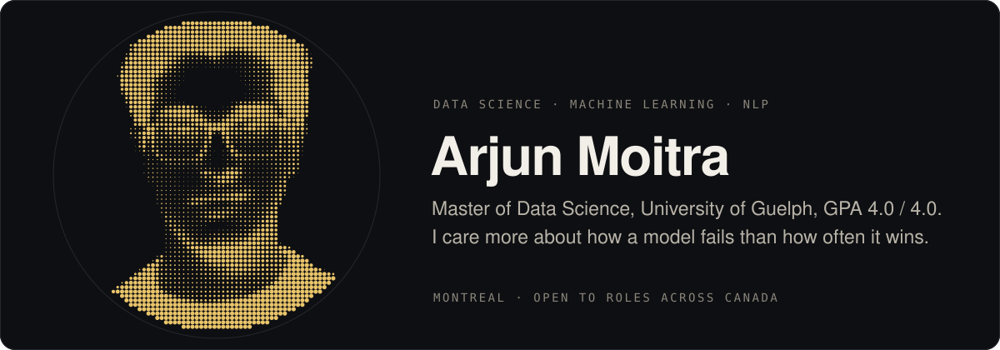

  

I build applied machine learning and NLP systems and spend most of my time on the part after the first result, where the model turns out to be fragile, the metric turns out to be the wrong one, or the effect turns out to be smaller than it looked. Master of Data Science from the University of Guelph, computer science from IIIT Delhi. Currently looking for data science, machine learning and AI roles in Canada.

## Featured work

| | |
|---|---|
| **[olist-delivery-impact](https://github.com/arjunmoitra/olist-delivery-impact)** | What does a late delivery actually cost? Four causal identification strategies on 96,470 marketplace orders agree on 2.0 review stars. Propensity matching, two way fixed effects, difference in differences, E value sensitivity, then a revenue model with a break even. dbt and DuckDB pipeline with 45 tests, Docker, GitHub Actions CI, Streamlit dashboard. |
| **[hoep-electricity-price-forecasting](https://github.com/arjunmoitra/hoep-electricity-price-forecasting)** | Ontario hourly electricity price, 1 to 3 hours ahead, on two years of IESO data. ARIMA, SARIMA, random forest, XGBoost, LSTM and GRU benchmarked against the market operator's own predispatch forecast. RMSE reduced by up to 36 percent on the best horizon. PySpark ingestion, strict temporal splits, DVC for data. |
| **[llm-fake-review-robustness](https://github.com/arjunmoitra/llm-fake-review-robustness)** | How stable is a zero shot LLM classifier when you rephrase the same task five ways? Mistral 7B flipped 34 percent of its predictions from prompt wording alone, Qwen 11 percent. The detailed prompt pushed recall to 1.00 by labelling almost everything fake. High recall was hiding low reliability. Supervised RoBERTa baseline for comparison. |

## More

- **[disease-ner-biobert](https://github.com/arjunmoitra/disease-ner-biobert)** BioBERT fine tuned on NCBI Disease for disease mention extraction, token level evaluation, Gradio demo.
- **[ITA_Chatbot](https://github.com/arjunmoitra/ITA_Chatbot)** Local multimodal assistant. Quantized Mistral 7B, Whisper for speech, LLaVA for images, PDF question answering over ChromaDB. No API keys, runs on a laptop. The research version was deployed to Meta Quest 2 in Unity at the IIIT Delhi ETIDM Lab.
- **[insurance-quote-conversion](https://github.com/arjunmoitra/insurance-quote-conversion)** 101,891 quotes, 22 percent bound. Class weighted random forest with a revenue optimal threshold sweep instead of a default cutoff.
- **[Taximan](https://github.com/arjunmoitra/Taximan)** Cab booking backend in Python and MySQL. Normalised schema with foreign keys, triggers that reject out of range ratings, a role based CLI over mysql connector, and documented conflict serializable and non serializable transaction schedules.
- **[Weather-aware-routing-dashboard](https://github.com/arjunmoitra/Weather-aware-routing-dashboard)** R Shiny. Live Ontario 511 road conditions and Environment Canada weather feeding Dijkstra routing over OpenStreetMap roads, with per condition speed penalties.
- **[dna-promoter-kmers](https://github.com/arjunmoitra/dna-promoter-kmers)** Promoter classification from k-mer frequencies on 36,130 sequences. SVM at 0.807 accuracy and 0.875 ROC AUC.

## Experience

**Research Assistant, University of Guelph** (May to August 2026). Stock return prediction from financial news. End to end pipeline over 10 million plus Reuters articles across 50,000 plus companies, joined to CRSP returns. Document embeddings from E5 Mistral 7B and BERT, purging regression to strip known firm characteristics, ridge on the residual, evaluated out of sample. Python, pandas, Slurm on a Linux cluster.

**Undergraduate Researcher, IIIT Delhi ETIDM Lab** (June 2024 to May 2025). LLM powered educational assistant for VR. Students query course PDFs by voice inside Meta Quest 2. Quantized open weight models on device, Whisper and LLaVA integration, user testing fed back into the prompting layer.

**Machine Learning Intern, Finstinct.ai** (May to July 2024). NLP classifier sorting financial news and reports into risk buckets for analysts.

## Stack

**Daily.** Python, pandas, NumPy, scikit-learn, PyTorch, Hugging Face Transformers, SQL, R, statsmodels, feature engineering, time series, model evaluation.

**Working knowledge.** PySpark, Docker, FastAPI, Git, Linux, Slurm, MySQL, DuckDB, dbt, XGBoost, Streamlit, R Shiny, Java.

**Have used, would not lead with.** Power BI, Tableau, Azure, GCP.

## Contact

[arjunmoitra62@gmail.com](mailto:arjunmoitra62@gmail.com) · [LinkedIn](https://www.linkedin.com/in/arjun-moitra-568068278) 
